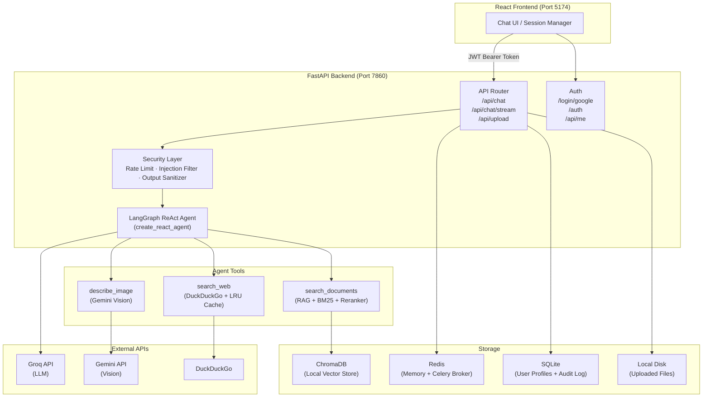
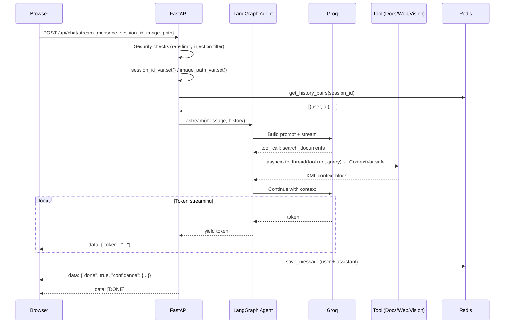
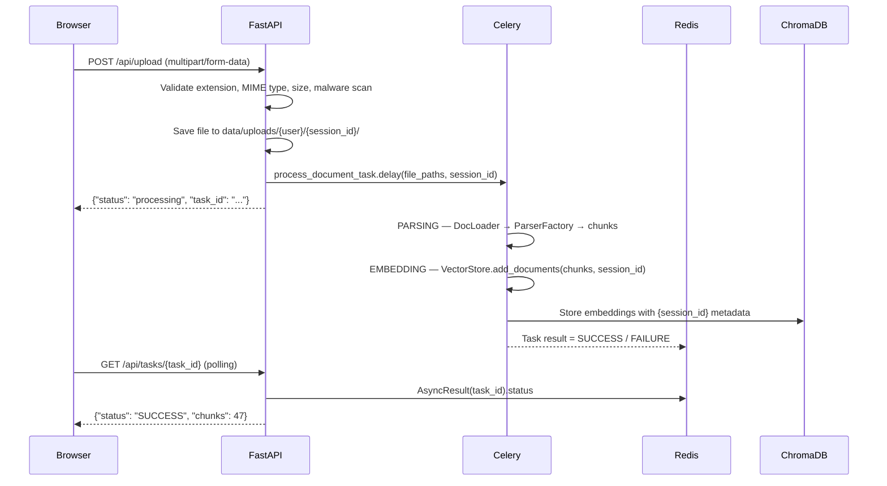

# Architecture Overview

## High-Level Architecture

NexusIQ uses a modern full-stack architecture: a **React/Vite** frontend communicates with a **FastAPI** backend. The core intelligence is a **LangGraph ReAct Agent** that routes queries to three specialized tools.



## Request Lifecycle

### Streaming Chat (`POST /api/chat/stream`)



### Document Upload (`POST /api/upload`)



## Dependency Injection

`main.py` initializes all singletons and attaches them to `app.state`. Each request accesses them via `request.app.state.*`.

```python
# main.py
vector_store      = VectorStore()          # ChromaDB / Pinecone
document_retriever = DocumentRetriever(vector_store)
search_doc_tool   = get_search_tool(document_retriever)
tools             = [search_doc_tool, search_web, describe_image]
agent             = MultimodalAgent(tools=tools)

app.state.agent        = agent
app.state.vector_store = vector_store
app.state.doc_loader   = DocumentLoader()
```

## Folder Structure

```text
multimodal_qa/
├── app/
│   ├── agent/
│   │   ├── workflow.py      # MultimodalAgent: run(), astream(), _rewrite_query(), _compress_history()
│   │   └── prompts.py       # Adaptive system prompt modules
│   ├── api/
│   │   ├── routes.py        # All /api/* endpoints
│   │   ├── auth.py          # Google OAuth + JWT endpoints
│   │   └── dependencies.py  # get_db(), get_current_user()
│   ├── core/
│   │   ├── config.py        # Centralized Config class
│   │   ├── context.py       # session_id_var, image_path_var (ContextVars)
│   │   ├── database.py      # SQLAlchemy models: User, AuditLog
│   │   ├── memory.py        # RedisMemoryManager
│   │   ├── security.py      # Rate limiter, injection filter, output sanitizer
│   │   ├── celery_app.py    # Celery application config
│   │   └── logger.py        # Structured logging
│   ├── rag/
│   │   ├── document_loader.py   # Orchestrates parsing + chunking
│   │   ├── chunker.py           # Multi-strategy chunker
│   │   ├── vector_store.py      # ChromaDB / Pinecone VectorStore
│   │   ├── document_retriever.py # Hybrid search + cross-encoder reranker
│   │   ├── tasks.py             # Celery task: process_document_task
│   │   ├── parsers/             # PDFParser, DocxParser, PptxParser, HtmlParser, MarkdownParser
│   │   └── retrieval/           # RetrieverFactory + 9 strategy classes + BGEReranker
│   ├── tools/
│   │   ├── document.py    # search_documents (sync + async coroutine)
│   │   ├── search.py      # search_web (DuckDuckGo + LRU cache)
│   │   ├── vision.py      # describe_image (Gemini Vision)
│   │   └── base.py        # @safe_call decorator
│   ├── vision/
│   │   ├── gemini_vision.py  # GeminiVision class (describe_image, adescribe_image, pdf_to_markdown)
│   │   └── utils.py          # prepare_image_for_api(), encode_image_to_base64()
│   └── main.py           # Application entrypoint
├── frontend/             # React + Vite + TypeScript UI
├── docs/                 # This documentation
├── tests/                # Pytest suite
├── Dockerfile
└── requirements.txt
```
