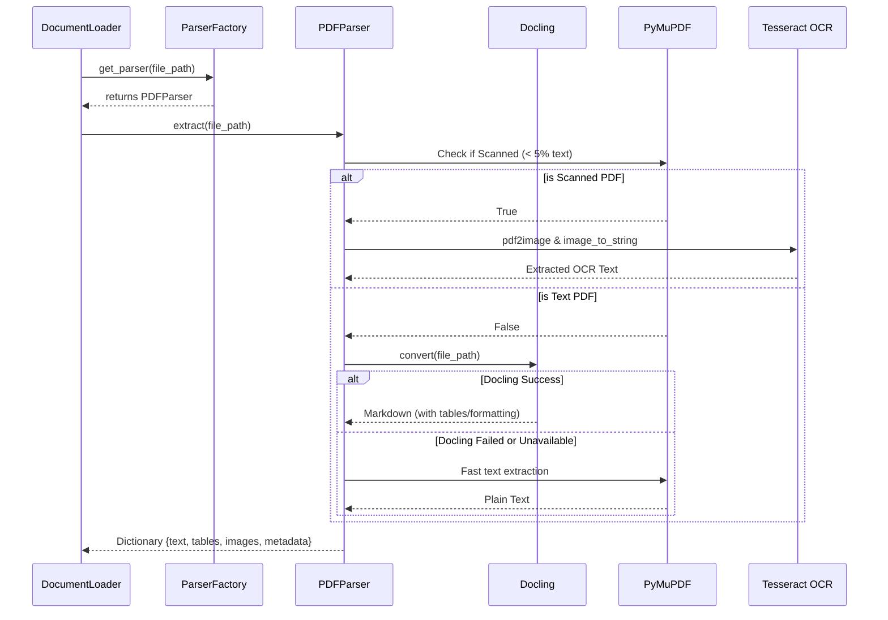

# Parser Architecture

The Document Parser module utilizes a **Factory Pattern** to dynamically route uploaded files to the correct extraction strategy based on their MIME type or file extension.

## Sequence Diagram

The following diagram illustrates the fallback parsing pipeline for PDFs, ensuring high-fidelity extraction of complex documents (tables/images) while providing OCR support for scanned documents.

## Supported Formats
- **PDF**: Handled by `PDFParser`. Uses a three-tier fallback (Docling -> PyMuPDF -> OCR).
- **DOCX**: Handled by `DocxParser` using `python-docx`. Extracts paragraphs and tables.
- **PPTX**: Handled by `PptxParser` using `python-pptx`. Extracts slide text.
- **HTML**: Handled by `HtmlParser` using `BeautifulSoup`. Strips scripts/styles and extracts text.
- **Markdown**: Handled by `MarkdownParser`. Directly loads content.

## Testing Strategy
Tests are located in `tests/test_parsers.py`. They verify:
1. Factory routing correctness.
2. PDF fallback logic (mocking PyMuPDF and OCR to simulate failures and scanned files).
3. Extraction Accuracy, calculated as a recall percentage of expected baseline words successfully recovered.
