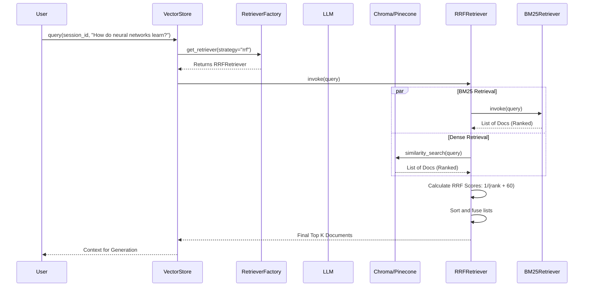

# Retrieval Architecture

The RAG Retrieval module abstracts the process of fetching relevant context from the Vector Store. It employs a Factory pattern to allow seamless switching between 9 advanced retrieval strategies, enabling easy A/B testing and performance tuning based on the query type.

## Supported Strategies
1. **Dense (`DENSE`)**: Standard similarity search using vector embeddings. Fastest and baseline.
2. **BM25 (`BM25`)**: Keyword-based sparse retrieval. Great for exact matches (names, IDs).
3. **Hybrid (`HYBRID`)**: Ensemble of Dense and BM25. Balances semantic meaning with exact keyword matching.
4. **Reciprocal Rank Fusion (`RRF`)**: Combines multiple retriever outputs by re-ranking based on inverse rank position. Superior to simple weight averaging.
5. **MMR (`MMR`)**: Maximal Marginal Relevance. Fetches more documents than requested and filters them to maximize diversity, preventing redundant information.
6. **Parent (`PARENT`)**: Retrieves small, precise "child" chunks, but returns the larger `parent_text` stored in metadata to provide the LLM with full context.
7. **Compression (`COMPRESSION`)**: Uses an LLM to actively compress and extract *only* the relevant sentences from retrieved chunks, minimizing context window usage.
8. **Multi-Query (`MULTI_QUERY`)**: Uses an LLM to generate multiple variations of the user's prompt (e.g. synonyms) to overcome vocabulary mismatches in the vector space.
9. **HyDE (`HYDE`)**: Hypothetical Document Embeddings. Uses an LLM to generate a hypothetical answer to the query, and embeds the *answer* instead of the *query* to search the vector space.

## Sequence Diagram: Multi-Query + RRF Flow

## Performance & Benchmarking
Run `pytest tests/benchmark_retrieval.py` to generate the `benchmark_report.md`. 
*Note: Strategies relying on LLMs (HyDE, Compression, Multi-Query) will exhibit significantly higher latency and API token costs than native DB strategies (Dense, MMR).*
