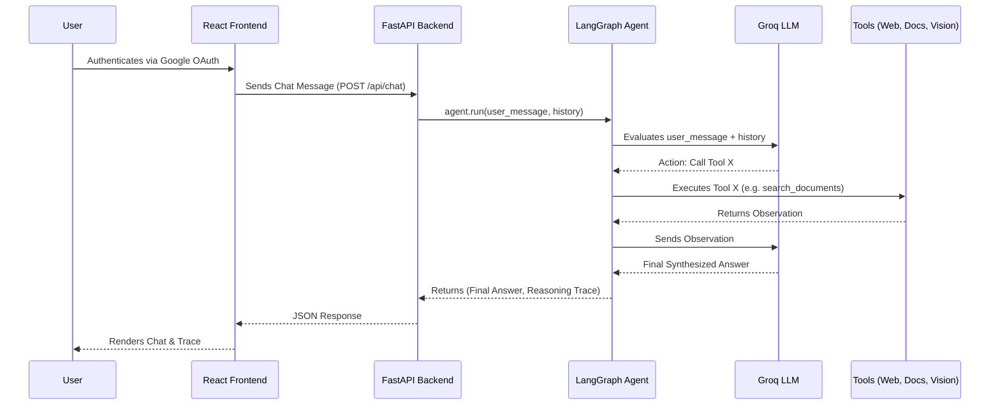

# Architecture Overview

## High-Level Architecture
The Multimodal Q&A Pro application relies on a **Modern Full-Stack Architecture** featuring a React/Vite frontend communicating with a **FastAPI** backend. The core intelligence is driven by a **Stateful AI Agent Architecture** orchestrated via **LangGraph**.

## Data Flow & Request Lifecycle



## Folder Structure
```text
multimodal_qa/
├── agent/            # LangGraph agent orchestration & prompts
├── api/              # FastAPI routers (auth, chat, upload)
├── core/             # Configuration, Logging, ContextVars, Database setup
├── docs/             # Comprehensive Project Documentation
├── frontend/         # React + Vite UI application
├── rag/              # Document splitting, embeddings, ChromaDB
├── tools/            # Tool implementations (Web, Docs, Vision)
├── vision/           # Groq Llama-Vision integration
├── main.py           # Application Entrypoint (FastAPI + Uvicorn)
└── requirements.txt  # Project Dependencies
```

## Dependency Injection Flow
To maintain testability and SOLID principles, the application avoids global singletons for core services.
1. `main.py` initializes the `VectorStore`, `DocumentLoader`, `SQLite DB`, and `MultimodalAgent`.
2. These instances are attached to `app.state` to be accessible across API endpoints.
3. The endpoints in `api/routes.py` retrieve these services from the FastAPI Request state, ensuring clean separation of concerns.
