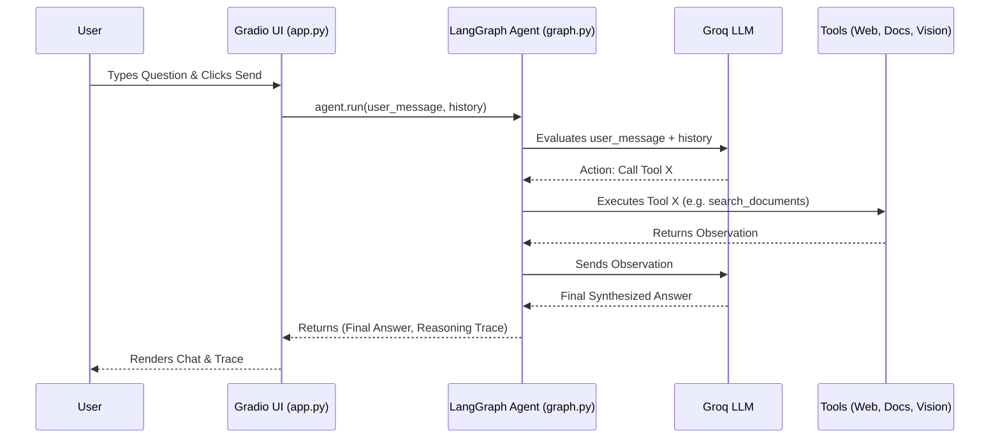

# Architecture Overview

## High-Level Architecture
The Multimodal Q&A Pro application relies on a **Server-Side Rendered Web Architecture** powered by Gradio, tightly coupled with a **Stateful AI Agent Architecture** powered by LangGraph. 

There is no traditional REST API or frontend/backend separation. Instead, the UI components and event handlers run within the same Python process as the AI Agent orchestration.

## Data Flow & Request Lifecycle



## Folder Structure
```text
multimodal_qa/
├── agent/            # LangGraph agent orchestration & prompts
├── core/             # Configuration, Logging, ContextVars
├── docs/             # Comprehensive Project Documentation
├── rag/              # Document splitting, embeddings, Pinecone/ChromaDB
├── tools/            # Pydantic-typed Langchain Tools
├── ui/               # Gradio layout and event handlers
├── vision/           # Groq Llama-Vision integration
├── main.py           # Application Entrypoint (Dependency Injection)
└── requirements.txt  # Project Dependencies
```

## Dependency Injection Flow
To maintain testability and SOLID principles, the application avoids global singletons.
1. `main.py` initializes the `VectorStore`, `DocumentLoader`, and `MultimodalAgent`.
2. These instances are passed into `ui/app.py` via the `build_app(vector_store, doc_loader, agent)` function.
3. The Gradio event handlers inside `build_app` capture these instances via closures, completely eliminating global state mutations.
