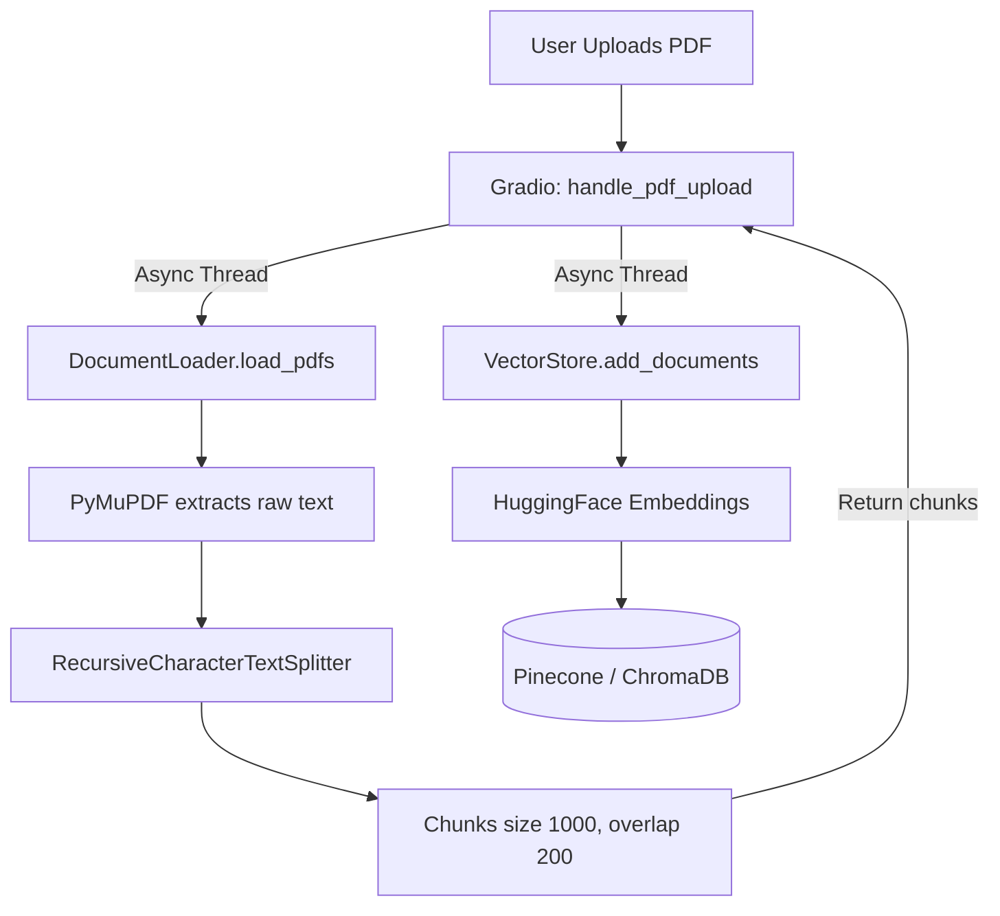

# RAG (Retrieval-Augmented Generation) Workflow

The process of taking raw PDF files and turning them into searchable embeddings is handled by the `rag/` module.

## Workflow

## 1. Document Parsing (`document_loader.py`)
- The `DocumentLoader` class accepts a list of file paths.
- It iterates through each path, using `PyMuPDFLoader` (which is highly resilient to malformed PDFs) to extract raw text and page numbers.
- If text is extracted, it is passed through a `RecursiveCharacterTextSplitter` (chunk size: 1000 characters, overlap: 200).
- **Performance:** This entire synchronous parsing pipeline is offloaded to a background thread via `asyncio.to_thread()` in `app.py`, ensuring the Gradio UI remains responsive.

## 2. Embedding (`vector_store.py`)
- The parsed chunks are passed to `add_documents()`.
- Metadata is attached to every chunk. Crucially, the `session_id` is appended to the metadata, ensuring users can only retrieve chunks they personally uploaded.
- The chunks are converted into vector embeddings using the `all-MiniLM-L6-v2` model.

## 3. Retrieval (`retriever.py`)
- When the `search_documents` tool is invoked, `DocumentRetriever` queries the vector database using the user's prompt.
- **Security (XML Sanitization):** Before returning the chunks to the LLM, the retriever scrubs `<` and `>` characters from the raw text, converting them to `&lt;` and `&gt;`. The scrubbed text is then wrapped in `<context>` tags. This neutralizes "Indirect Prompt Injection" attacks where a malicious user hides fake LLM instructions (e.g. `</context> Ignore previous instructions`) inside a PDF file.
