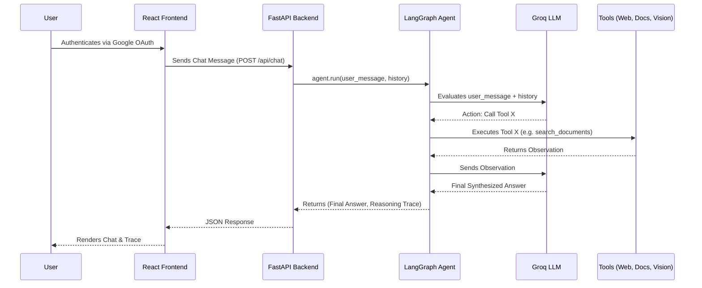

# Multimodal Q&A Pro - Project Analysis

## Architecture Diagram


## Folder Structure
```text
GenAI-main/
├── MultiModel/
│   ├── frontend/         # React 19 + Vite Frontend Application
│   │   ├── src/          # Source files (components, styles, api, etc.)
│   │   └── public/       # Static assets
│   └── multimodal_qa/    # FastAPI + LangGraph Backend Application
│       ├── agent/        # LangGraph agent orchestration, state, and prompts
│       ├── api/          # FastAPI routers (auth, chat, upload)
│       ├── core/         # Config, logging, context vars, database setup
│       ├── docs/         # Comprehensive documentation
│       ├── rag/          # Document chunking, embeddings, vector store
│       ├── tools/        # Tool implementations (Web, Docs, Vision)
│       ├── vision/       # Groq Llama-Vision integration
│       └── tests/        # Pytest unit tests
└── ... (Weekly assignments week1 to week6)
```

## File Responsibilities
- `api/routes.py`: Defines core endpoints for chat (`/api/chat`, `/api/chat/stream`), search, history, and document upload (`/api/upload`). Handles rate limiting, prompt injection filtering, sanitization, and DB interactions.
- `api/auth.py`: Implements Google OAuth flow, login, logout, and `/api/me` session validation endpoints.
- `agent/graph.py`: Initializes the LangGraph ReAct agent. Dynamically sets LLM temperature based on query intent. Handles query rewriting for better RAG, conversation memory summarization, and a self-reflection feedback loop for quality checks.
- `rag/vector_store.py`: Wraps ChromaDB and Pinecone to provide hybrid vector + BM25 search. Manages indexing of Document chunks partitioned by `session_id`.
- `vision/groq_vision.py`: Pre-processes images (resizing, base64 encoding, converting RGBA to RGB) and sends them to the Groq Vision model (`llama-3.2-11b-vision-preview`) for visual analysis.

## Request Flow
1. **Authentication**: Users log in via Google OAuth. Session state is managed via Starlette session cookies.
2. **Document/Image Upload**: A user uploads PDFs or images to a specific chat session. PDFs are chunked, vectorized locally via HuggingFace models, and saved to a vector database (Chroma/Pinecone). Images are encoded via Base64.
3. **Chat Prompt Generation**: An incoming chat query triggers the backend, where it may be rewritten dynamically by an LLM to remove ambiguities. A tailored system prompt is injected, adjusting the temperature based on the intent (e.g., 0.05 for coding, 0.7 for creative tasks).
4. **Agent Invocation**: The LLM evaluates the prompt + history inside a LangGraph ReAct loop.
5. **Tool Usage**: The agent decides if it needs tools (e.g., local document vector search, web search via DuckDuckGo, or vision).
6. **Self-Reflection & Response**: The agent synthesizes a final answer, undergoes a self-reflection critique, and streams the output via SSE to the frontend React UI.

## Frontend-Backend Communication
- **RESTful Endpoints**: Used for metadata, history fetching, OAuth, and file uploading (`axios`).
- **Server-Sent Events (SSE)**: Used in `/api/chat/stream` for real-time, token-by-token streaming of the LangGraph agent responses to provide an immediate user experience.
- **Cookies**: Session identifiers are encrypted in a `SameSite=Lax` HTTP-only cookie automatically exchanged in requests.

## RAG Pipeline
- **Ingestion**: Raw text from PDFs and Markdown files is extracted and broken into overlapping chunks using `LangChain` document loaders.
- **Embedding**: `HuggingFaceEmbeddings` maps textual chunks into high-dimensional space vector representations on the CPU.
- **Storage**: Vectors are locally persisted in ChromaDB or pushed to Pinecone, tagged by the `session_id`.
- **Hybrid Retrieval**: Search combines purely semantic vector similarities with exact-keyword matching using `BM25`. An ensemble retriever fuses these results.

## Parser Pipeline
- For incoming documents, a custom validation step checks the MIME type and guards against unsupported formats.
- For output generated by the LLM, the backend applies an internal output sanitization function before streaming it out, neutralizing potential malicious script injections in Markdown.
- The frontend relies on `react-markdown` alongside `remark-math` and `rehype-katex` to safely parse standard markdown, mathematical equations, and syntax-highlighted code blocks for presentation.

## Agent Routing
- Operated by `LangGraph`, this ReAct agent iteratively loops through Observation, Decision, Action phases.
- The Agent possesses three main toolsets: `search_documents`, `describe_image`, and `search_web`. The LLM's own intelligence decides which is necessary.
- "Query Rewriting" intercepts conversational context ("tell me about the second one") and transforms it into standalone searchable terms before the agent loop is fully engaged.

## Vision Pipeline
- If an image path is present in context (`core.context.image_path_var`), the agent may invoke the `describe_image` tool.
- The `GroqVision` class processes the file: it strips alpha layers (RGBA to RGB), downscales it to max 1024x1024, converts it to base64 `image/jpeg`.
- The encoded image is forwarded to the `llama-3.2-11b-vision-preview` multimodal LLM alongside a textual prompt to retrieve a visual description, appending it to the agent's observation memory.

## Vector Database Usage
- Supports both **ChromaDB** (local disk) and **Pinecone** (cloud-hosted).
- A wrapper abstractly handles document additions, duplicate hash-filtering, and dynamic retrieval.
- Crucially, all indexed documents are tagged with a `session_id` in their metadata. Searches are strictly filtered by this metadata flag to isolate vector data across parallel users securely.

## Embedding Flow
- Leverages the `sentence-transformers` models wrapped in LangChain's `HuggingFaceEmbeddings`.
- Executed synchronously on CPU during the file upload step.
- Redundancy checks happen before generation: `VectorStore` checks if document hashes already exist in the database for the active session to avoid duplicated token embedding.

## Chat Pipeline
- Evaluates if the message exceeds max character limits or contains known prompt injections.
- Dynamically calculates the context history and compresses it via summarization if it breaches the memory threshold.
- Employs a dynamic temperature function to vary LLM creativity based on user wording (e.g., technical queries are rigid, storytelling queries are loose).
- Computes confidence scores heuristically by analyzing the structure and content of the agent's output.

## Configuration Management
- Configuration is largely managed via standard environment variables parsed in `core.config.py` (e.g., `GROQ_API_KEY`, `PINECONE_API_KEY`, `GOOGLE_CLIENT_ID`).
- API keys support fallback arrays to handle rate limits (e.g. `GROQ_API_KEYS`).
- Global constants (like persistent DB directories, timeout lengths) are strongly typed inside a centralized settings object.

## Deployment Process
- Currently designed for local execution via Node.js (`npm run dev`) and Uvicorn (`python main.py`).
- Relies on SQLite mappings, meaning a local `.db` file holds all relational data without external cluster dependencies.
- No CI/CD pipelines (GitHub Actions, Dockerfiles) are visibly defined in the project root to formalize production-level staging.

---

## Current Weaknesses
- **Monolithic Agent State**: `agent/graph.py` contains dense monolithic logic combining prompt generation, query rewriting, and LLM temperature configurations.
- **Branching Database Logic**: `rag/vector_store.py` utilizes extensive `if self.is_pinecone:` branching rather than cleanly adopting a Strategy pattern, making the code harder to read.
- **Synchronous Operations**: Document chunking, image downscaling, and embedding generation block the main FastAPI thread, heavily impacting parallel latency.

## Technical Debt
- **Suppressed Exceptions**: Catch-all empty `except Exception: pass` blocks exist during ChromaDB initialization, burying potential critical failures.
- **Scattered Prompts**: System prompts sit as constants alongside application logic rather than residing in decoupled templates or configuration maps.
- **File System Management**: Uploaded documents map to raw disk folders with no proactive automated background cleanup protocol, meaning storage slowly degrades as old sessions sit idle.

## Performance Bottlenecks
- **SQLite Concurrency**: Simultaneous writes to SQLite from heavy chat streaming will induce database locking.
- **CPU-bound Embeddings**: Operating HuggingFace embedding encoders locally on CPU stalls the upload endpoint substantially for large PDF files.
- **Inefficient BM25 Initialization**: Hybrid retrieval logic pulls the entire session's document pool into system memory sequentially via `.get()` on every query to instantiate the BM25 model, destroying horizontal scalability.

## Security Issues
- **Path Traversal Risk**: Direct concatenation of `session_id` strings (`os.path.join(..., session_id)`) to form system paths risks traversal exploits if inputs are maliciously crafted.
- **Cookie Security Over HTTP**: With no explicit secure configurations, sessions may be exposed on non-HTTPS environments.
- **API Key Overexposure**: Fallbacks manually load multiple Groq Keys from one `.env` mapping without sophisticated secret lifecycle management or rotation protections.

## Missing Tests
- **API Test Coverage**: Only fundamental agent unit testing (`test_agent.py`) exists. Endpoint integration tests, RAG upload testing, and OAuth simulation are completely absent.
- **Frontend Confidence**: No tests exist in the React frontend (neither Jest, Vitest, nor end-to-end Cypress tests).
- **Vision Pipeline Testing**: Missing mock tests to validate the Groq Vision encoding integration correctly handles edge-case MIME types.

## Improvement Opportunities
- **Asynchronous Task Queues**: Integrate `Celery` or `RQ` to push document embedding and summarization off the core event loop.
- **Database Migration**: Switch the production target from SQLite to PostgreSQL (relying on the existing `psycopg2-binary` dependency) for robust concurrent thread safety.
- **Pattern Refactoring**: Redesign `VectorStore` into interface-driven subclasses (`ChromaStore` and `PineconeStore`) to extinguish the `is_pinecone` conditional sprawling.
- **Decoupled Agent Sub-graphs**: Decompose the massive single LangGraph into multi-agent sub-graphs (e.g., Code Analyst Agent vs. Web Searcher Agent) governed by a lightweight Router.
- **Strict Identifier Validation**: Implement Regex validators on all incoming session and user identifiers to neutralize arbitrary path traversal attempts proactively.
